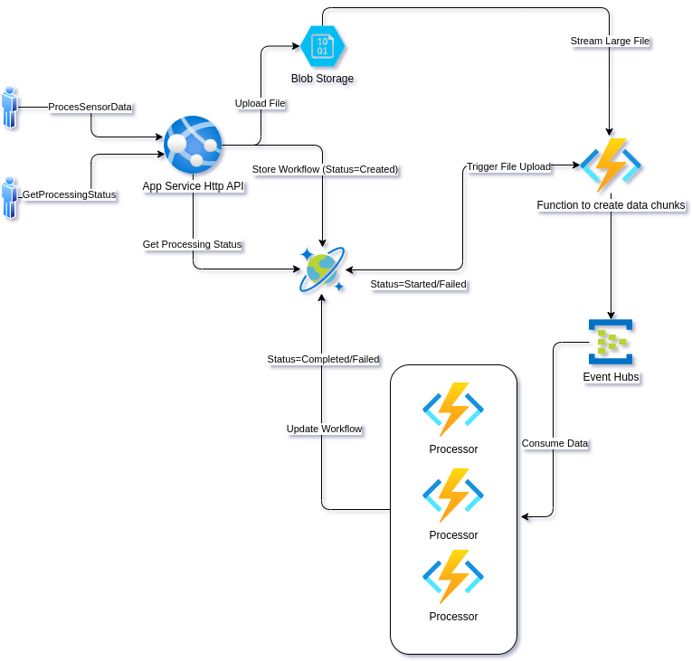
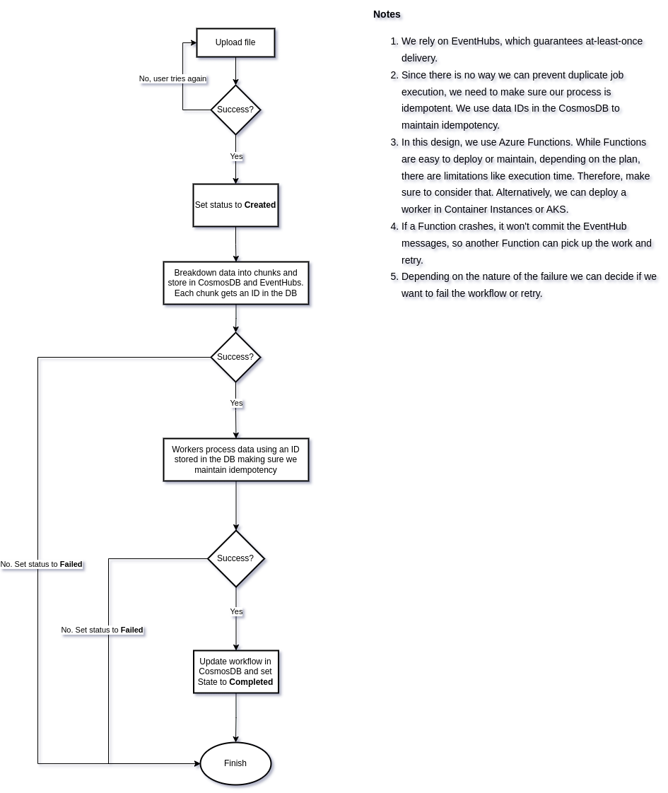

# Flosonics Assignment

## Requirements:
1. Dotnet Core 7.0
2. Visual Studio Code
3. C# Extension for Visual Studio Code

## How to build:
``` bash
dotnet build
```

## How to test:
``` bash
dotnet test
```

## How to run:
``` bash
dotnet run
```

## Diagrams:
Use [draw.io](https://app.diagrams.net/) to open the diagrams.

### System Design:


### Workflow:
